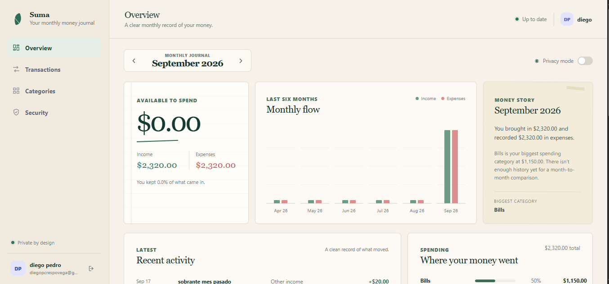

# Suma

**A personal finance journal that explains your month instead of only showing charts.**

Suma is a full-stack personal finance application built as a software-engineering portfolio project. It helps users record transactions, organize spending, set budgets and savings goals, and understand how their money changed from month to month.



## Why Suma

Most finance dashboards stop at totals and charts. Suma adds a more human layer: a monthly **Money Story** that turns the user's real data into a short, deterministic summary of what happened during the month.

The project also focuses heavily on backend ownership and security. Every financial resource is scoped to the authenticated user, sessions can be revoked server-side, and write requests are protected against common web attacks.

## Highlights

- Monthly overview with income, expenses, balance and six-month flow
- Deterministic **Money Story** generated from real financial data
- Transactions with search, type/month filters, cursor pagination and CRUD
- Custom income and expense categories
- Monthly budgets and savings goals
- Multi-user data isolation enforced by the backend
- Active-session management with individual revocation and logout-all
- Responsive React interface with a journal/ledger visual language
- Automated backend tests and GitHub Actions CI

## Tech stack

### Frontend
- React 19
- JavaScript
- Vite
- CSS

### Backend
- Node.js
- Express 5
- REST API

### Data
- PostgreSQL
- Parameterized SQL queries
- Cursor pagination

### Security
- bcrypt password hashing
- JWT stored in HttpOnly cookies
- Revocable server-side sessions using `jti`
- CSRF tokens bound to the active session
- Exact Origin validation for browser writes
- Login/register rate limiting
- Server-side input validation
- Security headers and body-size limits
- Structured/redacted security logging

## Architecture

```text
Browser / React
      |
      | HTTP + JSON
      v
Express API
      |
      | authentication / authorization / validation
      v
PostgreSQL
```

The frontend never decides resource ownership. Authenticated identity is derived by the backend from the validated session (`req.user.id`) and is used to scope database queries.

## Local setup

### Requirements

- Node.js 22+
- npm
- PostgreSQL

Local secrets are intentionally stored outside the repository. On the original Windows development environment the configuration file lives at:

```text
C:\Users\<USER>\.finance-app.env
```

After configuring the environment, run:

```powershell
.\setup-local.ps1
.\start-dev.ps1
```

Development URLs:

```text
Frontend  http://localhost:5173
Backend   http://localhost:3000
```

## Database

Main tables:

```text
users
categories
transactions
budgets
savings_goals
auth_sessions
```

Migrations are stored in `backend/sql/` and are applied by `setup-local.ps1`.

## Tests

Backend tests cover validation, pagination, CSRF/session binding and rate limiting.

```powershell
cd backend
npm test
```

Frontend checks:

```powershell
cd frontend
npm run lint
npm run build
```

The same checks run automatically through `.github/workflows/ci.yml` on pushes and pull requests to `main`.

## Security notes

The repository includes the security hardening notes and audit history used while building the project:

- `SECURITY.md`
- `docs/security/SECURITY_AUDIT_BASELINE.md`
- `docs/security/SECURITY_AUDIT_V2.md`
- `docs/security/HARDENING_CHECKPOINT.md`

## Status

Suma is currently being prepared for a public portfolio deployment. The next delivery step is deployment and adding the live demo URL to this README.
